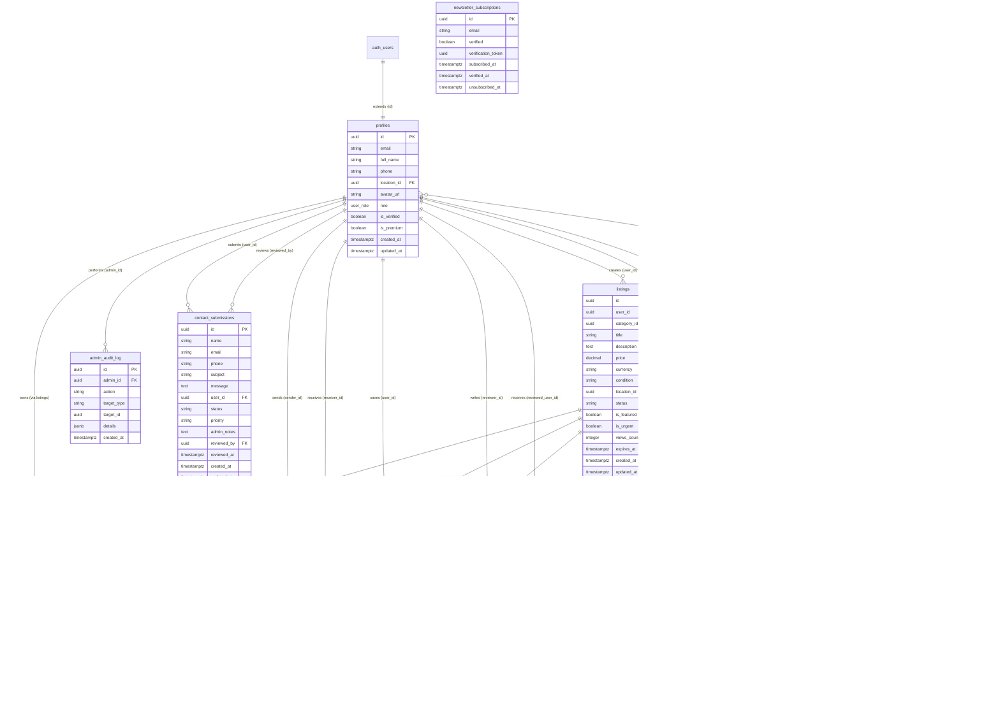

# Metalcutting-Hub

A Bulgarian marketplace SAAS for buying and selling metalcutting tools, measuring equipment, spare parts, and documentation. Similar to Bazar.bg and OLX.bg but focused specifically on the metalworking industry.

## Status

**Active Development** — Core application is built and functional. MVP feature set is largely complete.

## What's Built

### Frontend Architecture
- **Build System**: Vite with ES modules
- **UI Framework**: Bootstrap 5.3.8
- **Client-side Routing**: Custom router implementation
- **Language**: JavaScript (vanilla, no framework)

### Pages Implemented

| Category | Pages |
|----------|-------|
| **Public** | Home, Login, Register, Contact |
| **Listings** | List view, Details, Create, Edit |
| **User** | Profile, My Listings, Watchlist |
| **Admin** | Dashboard, Listings, Users, Categories, Audit, Reports, Contact Messages |
| **Moderator** | Dashboard, Listings, Categories, Reports, Contact Messages |
| **Messages** | Messages page |

### Services & Architecture

| Layer | Components |
|-------|------------|
| **Services** | Auth (Supabase), Listings CRUD, Storage (images), Admin, Contact, Newsletter Subscription |
| **Utilities** | Validators, Formatters, Helpers, Supabase client |
| **Components** | Navbar, Footer, ListingCard, Toast notifications |

### Backend
- **Supabase**: PostgreSQL + Auth + Storage
- **MCP**: Supabase MCP server configured in `.vscode/mcp.json`

## Tech Stack

| Area | Technology |
|------|------------|
| **Frontend** | Vanilla JavaScript + Vite |
| **Backend** | Supabase (PostgreSQL + Auth + Storage) |
| **Database** | PostgreSQL with Row-Level Security |
| **Styling** | Bootstrap 5 + Custom CSS + Sass |
| **Language** | Bulgarian (bg-BG) primary |

## Development

```bash
# Install dependencies
npm install

# Start dev server
npm run dev

# Build for production
npm run build

# Preview production build
npm run preview
```

## Documentation

- **[Research & Requirements](./Research_metalcutting_hub_requirements.md)** - Comprehensive research on marketplace SAAS requirements, tech stack recommendations, and Bulgarian market considerations

## Database Schema

### Core Tables

#### `profiles`
Extends Supabase auth.users with user profile data.

| Column | Type | Description |
|--------|------|-------------|
| `id` | UUID | Primary key (references auth.users) |
| `email` | VARCHAR | User's email (synced from auth.users) |
| `full_name` | VARCHAR(100) | User's full name |
| `phone` | VARCHAR(20) | Contact phone number |
| `location_id` | UUID | Foreign key to locations |
| `avatar_url` | VARCHAR(255) | Profile image URL |
| `role` | user_role | 'user', 'moderator', or 'admin' |
| `is_verified` | BOOLEAN | Account verification status |
| `is_premium` | BOOLEAN | Premium membership flag |
| `created_at` | TIMESTAMPTZ | Account creation timestamp |
| `updated_at` | TIMESTAMPTZ | Last update timestamp |

#### `listings`
Main marketplace listings table.

| Column | Type | Description |
|--------|------|-------------|
| `id` | UUID | Primary key |
| `user_id` | UUID | Foreign key to profiles (seller) |
| `category_id` | UUID | Foreign key to categories |
| `title` | VARCHAR(200) | Listing title |
| `description` | TEXT | Full item description |
| `price` | DECIMAL(12,2) | Item price |
| `currency` | VARCHAR(3) | Currency code (default: BGN) |
| `condition` | VARCHAR(20) | 'new', 'used', or 'refurbished' |
| `location_id` | UUID | Foreign key to locations |
| `status` | VARCHAR(20) | 'active', 'sold', 'draft', 'expired', 'pending', or 'rejected' |
| `rejection_reason` | TEXT | Reason for rejection (if status is 'rejected') |
| `reviewed_by` | UUID | Foreign key to profiles (moderator who reviewed) |
| `reviewed_at` | TIMESTAMPTZ | When the listing was reviewed |
| `is_featured` | BOOLEAN | Featured listing flag |
| `is_urgent` | BOOLEAN | Urgent listing flag |
| `views_count` | INTEGER | View counter |
| `expires_at` | TIMESTAMPTZ | Listing expiration date |
| `created_at` | TIMESTAMPTZ | Creation timestamp |
| `updated_at` | TIMESTAMPTZ | Last update timestamp |

#### `listing_images`
Images associated with listings.

| Column | Type | Description |
|--------|------|-------------|
| `id` | UUID | Primary key |
| `listing_id` | UUID | Foreign key to listings |
| `storage_path` | VARCHAR(255) | Supabase Storage path |
| `order_index` | INTEGER | Display order |
| `is_primary` | BOOLEAN | Primary image flag |
| `created_at` | TIMESTAMPTZ | Upload timestamp |

#### `categories`
Hierarchical category structure for marketplace items.

| Column | Type | Description |
|--------|------|-------------|
| `id` | UUID | Primary key |
| `name_bg` | VARCHAR(100) | Category name (Bulgarian) |
| `name_en` | VARCHAR(100) | Category name (English) |
| `slug` | VARCHAR(100) | URL-friendly identifier |
| `parent_id` | UUID | Self-reference for hierarchy |
| `icon_url` | VARCHAR(255) | Category icon URL |
| `sort_order` | INTEGER | Display order |
| `created_at` | TIMESTAMPTZ | Creation timestamp |

#### `locations`
Bulgarian geographical locations (cities and regions).

| Column | Type | Description |
|--------|------|-------------|
| `id` | UUID | Primary key |
| `name_bg` | VARCHAR(100) | Location name (Bulgarian) |
| `name_en` | VARCHAR(100) | Location name (English) |
| `type` | VARCHAR(20) | 'city' or 'region' |
| `parent_id` | UUID | Self-reference for hierarchy |
| `created_at` | TIMESTAMPTZ | Creation timestamp |

#### `messages`
User-to-user messaging system.

| Column | Type | Description |
|--------|------|-------------|
| `id` | UUID | Primary key |
| `listing_id` | UUID | Foreign key to listings |
| `sender_id` | UUID | Foreign key to profiles (sender) |
| `receiver_id` | UUID | Foreign key to profiles (receiver) |
| `content` | TEXT | Message content |
| `is_read` | BOOLEAN | Read status |
| `created_at` | TIMESTAMPTZ | Sent timestamp |

#### `watchlist`
User's saved listings.

| Column | Type | Description |
|--------|------|-------------|
| `user_id` | UUID | Foreign key to profiles |
| `listing_id` | UUID | Foreign key to listings |
| `created_at` | TIMESTAMPTZ | Added timestamp |

#### `reviews`
User reviews and ratings.

| Column | Type | Description |
|--------|------|-------------|
| `id` | UUID | Primary key |
| `reviewer_id` | UUID | Foreign key to profiles (reviewer) |
| `reviewed_user_id` | UUID | Foreign key to profiles (reviewed) |
| `listing_id` | UUID | Foreign key to listings |
| `rating` | INTEGER | Rating from 1 to 5 |
| `comment` | TEXT | Review comment |
| `created_at` | TIMESTAMPTZ | Review timestamp |

#### `admin_audit_log`
Audit trail for admin/moderator actions.

| Column | Type | Description |
|--------|------|-------------|
| `id` | UUID | Primary key |
| `admin_id` | UUID | Foreign key to profiles |
| `action` | VARCHAR(50) | Action performed |
| `target_type` | VARCHAR(50) | Target entity type |
| `target_id` | UUID | Target entity ID |
| `details` | JSONB | Additional action details |
| `created_at` | TIMESTAMPTZ | Action timestamp |

#### `reports`
User reports for listings (inappropriate content, scams, etc.).

| Column | Type | Description |
|--------|------|-------------|
| `id` | UUID | Primary key |
| `listing_id` | UUID | Foreign key to listings |
| `reporter_id` | UUID | Foreign key to profiles (reporter) |
| `reason` | TEXT | Reason for the report |
| `status` | VARCHAR(50) | 'pending', 'reviewed', 'resolved', or 'dismissed' |
| `reviewed_by` | UUID | Foreign key to profiles (admin who reviewed) |
| `reviewed_at` | TIMESTAMPTZ | When the report was reviewed |
| `admin_notes` | TEXT | Internal notes from admin |
| `created_at` | TIMESTAMPTZ | Report creation timestamp |

#### `newsletter_subscriptions`
Email subscriptions for newsletter.

| Column | Type | Description |
|--------|------|-------------|
| `id` | UUID | Primary key |
| `email` | VARCHAR(255) | Subscriber email (unique) |
| `verified` | BOOLEAN | Email verification status |
| `verification_token` | UUID | Token for email verification |
| `subscribed_at` | TIMESTAMPTZ | Subscription timestamp |
| `verified_at` | TIMESTAMPTZ | When email was verified |
| `unsubscribed_at` | TIMESTAMPTZ | When user unsubscribed |

#### `contact_submissions`
Contact form submissions from users (both authenticated and anonymous).

| Column | Type | Description |
|--------|------|-------------|
| `id` | UUID | Primary key |
| `name` | TEXT | Contact name |
| `email` | TEXT | Contact email |
| `phone` | TEXT | Contact phone (optional) |
| `subject` | TEXT | Message subject |
| `message` | TEXT | Message content |
| `user_id` | UUID | Foreign key to profiles (if authenticated) |
| `status` | TEXT | 'new', 'read', 'in_progress', 'resolved', or 'spam' |
| `priority` | TEXT | 'low', 'normal', 'high', or 'urgent' |
| `admin_notes` | TEXT | Internal notes from admin/moderator |
| `reviewed_by` | UUID | Foreign key to profiles (who reviewed) |
| `reviewed_at` | TIMESTAMPTZ | When the submission was reviewed |
| `created_at` | TIMESTAMPTZ | Submission timestamp |
| `updated_at` | TIMESTAMPTZ | Last update timestamp |

### Storage Buckets

Supabase Storage buckets for file uploads:

| Bucket | Public | Size Limit | MIME Types | Purpose |
|--------|--------|------------|------------|---------|
| `listing-images` | Yes | 5MB | image/jpeg, image/png, image/webp | Listing photos |
| `category-icons` | Yes | 2MB | image/jpeg, image/png, image/webp, image/svg+xml | Category icons |
| `avatars` | Yes | 2MB | image/jpeg, image/png, image/webp, image/gif | User avatars |

### Edge Functions

Supabase Edge Functions for server-side logic:

| Function | Purpose |
|----------|---------|
| `send-confirmation` | Sends newsletter subscription confirmation emails via Resend API |

### Entity Relationship Diagram



### Database Features

- **Row-Level Security (RLS)**: All tables have RLS policies enforcing data access control
- **Full-Text Search**: Bulgarian language support via `pg_trgm` extension
- **Triggers**: Auto-update `updated_at` timestamps and view counting
- **Indexes**: Performance-optimized indexes for common query patterns

### Database Migrations

| # | Migration | Description |
|---|-----------|-------------|
| 001 | `initial_schema` | Core tables: profiles, listings, categories, locations, messages, watchlist, reviews |
| 002 | `rls_policies` | Row-Level Security policies for all tables |
| 003 | `seed_data` | Initial seed data for categories and locations |
| 004 | `indexes_functions` | Performance indexes and helper functions |
| 005 | `admin_tables` | Admin audit log and related tables |
| 006 | `add_increment_views_rpc` | RPC function for incrementing listing views |
| 007 | `create_category_icons_bucket` | Storage bucket for category icons |
| 008 | `add_email_to_profiles` | Add email column to profiles table |
| 009 | `create_avatars_bucket` | Storage bucket for user avatars |
| 010 | `create_reports_table` | User reports table for listing moderation |
| 011 | `allow_moderators_view_audit_log` | Allow moderators to view admin audit log |
| 012 | `add_pending_status` | Add pending/rejected status and review columns to listings |
| 013 | `fix_listing_images_rls_for_moderators` | Allow moderators to view images of pending listings |
| 014 | `create_newsletter_subscriptions` | Newsletter subscription table with email verification |
| 015 | `create_contact_submissions` | Contact form submissions table for admin/moderator management |

## Remaining Work

- [ ] TypeScript migration (optional)
- [ ] Testing suite (no tests yet)
- [ ] Framework decision (stay vanilla or migrate to Next.js)
- [ ] Production deployment configuration
- [ ] Additional features (payments, advanced search, etc.)

## License

MIT
